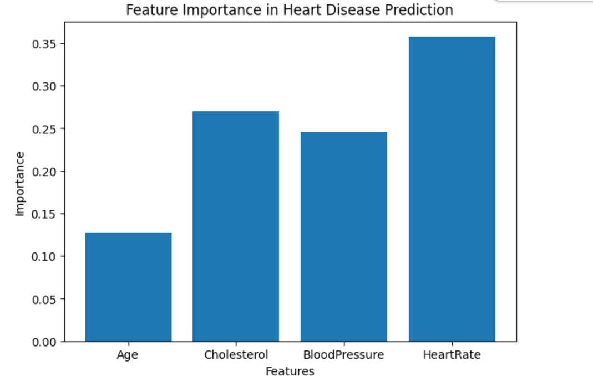
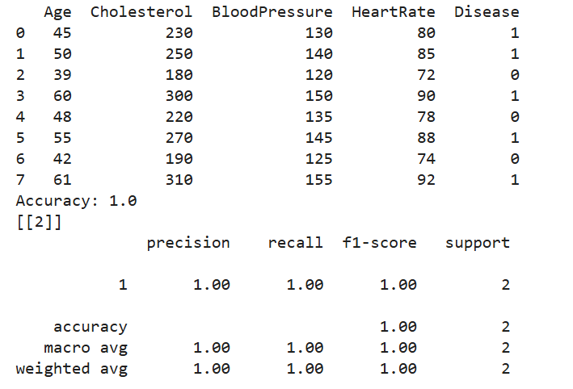

# Heart-Disease-Prediction-Using-Machine-Learning
Machine Learning-based heart disease prediction using healthcare data
This project predicts heart disease using Machine Learning classification models and healthcare data.

## Technologies Used
- Python
- Pandas
- Scikit-learn
- Matplotlib

## Algorithms Used
- Random Forest Classifier
- Decision Tree
- Logistic Regression

## Workflow
1. Load healthcare dataset
2. Perform data preprocessing
3. Split dataset into training and testing sets
4. Train Machine Learning classification model
5. Evaluate model performance
6. Visualize feature importance

## Features
- Data preprocessing
- Classification model
- Accuracy evaluation
- Feature importance visualization

## Applications
- Healthcare Analytics
- Disease Prediction
- Machine Learning
## Output

## Future Improvements

- Use larger healthcare datasets
- Improve prediction accuracy
- Deploy as a web application
- Integrate Deep Learning techniques
## Author

Innbhakkavi K
Bioinformatics Undergraduate
